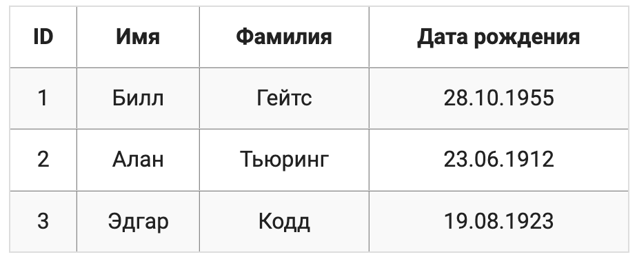
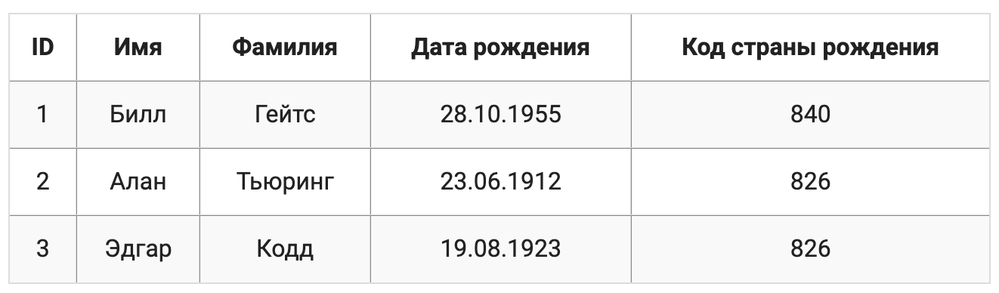
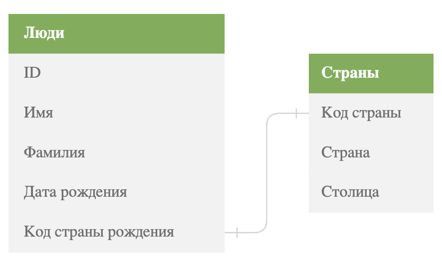

# 2.2 Реляционные базы данных

Среди всех существующих моделей баз данных, на данный момент доминирующей является реляционная модель, предложенная Эдгаром Коддом (специалистом в области математики и информатики) в 1970-м году

<kbd>

Эдгар Кодд за свой вклад в развитие баз данных был удостоен большим количеством наград, включая премию Тьюринга которую он получил в 1981 году

</kbd>

Реляционная модель представляет собой совокупность данных, состоящих из набора таблиц. В теории множеств которая легла в основу проектирования реляционной модели есть термин который соответствует таблице - отношения(relations) а таблица является его физическим представлением. Именно по этому модель получила свое название - реляционная.

Любая таблица в реляционной базе данных состоит из строк называемых **записями** и столбцов которые называют **полями**. На пересечении строк и столбцов находятся конкретные значения. Запись представляет собой набор значений, содержащих информацию о конкретной сущности, полем же является отдельная характеристика сущности.

Например, в таблице ниже содержатся 3 записи, 4 поля и 12 значений:

<kbd>

</kbd>

Таблица в реляционной базе данных обладает рядом необычных свойств, которые отличают ее от обычных таблиц. Каждое поле всегда имеет уникальное имя и тип данных, хранимых в этом поле. Если поле используется для хранения имени то его тип будет: строковым, если для возраста - числовым. Никакая другая таблица в реляционной базе данных не может носить то же имя что и другая.

# Первичный ключ

Поле (или несколько полей), значения которого однозначно определяют записи таблицы, называется **первичным ключом** (primary key).
То есть первичный ключ - это такое поле, значение которого в таблице не повторяются. Так, в таблице представленной выше поле `ID` выступает первичным ключом, предоставляющее уникальный идентфикатор определенного человека. Первичным ключом могли быть поля `Имя` и `Фамилия`, однако у людей могут быть одинаковые имена и фамилии, поэтому для однозначности в таблицу было включено поле `ID`

<kbd>

Первичный ключ, состоящий из одного поля называют простым. В случае если первичный ключ включает несколько полей его называют составным

</kbd>

# Внешний ключ

Таблица может содержать информацию, используемую для связи с другой таблицей. Осуществляется такая навигация с помощью **внешних ключей** (foreign key). Для понимания того как работают внешние ключи рассмотрим таблицу:

<kbd>

</kbd>

Первичным ключом здесь является поле **Код страны** 

Расширим также таблицу, предложенную вначале урока - добавим в нее поле с кодом страны рождения, в качестве значений этого поля  воспользуемся значениями первичного ключа таблицы с данными о странах:

<kbd>

</kbd>

Во второй таблице поле `Код страны рождения` представляет собой внешний ключ. То есть внешний ключ это поле в одной таблице, которые связывается с первичным ключом другой таблицы. Он задает связь между таблицами, позволяя ссылаться на данные в одной таблице из другой таблицы. Внешний ключ также как и первичный может включать в себя несколько полей.

<kbd>

Таблица которая ссылается на данные из другой таблицы называется дочерней, таблица на данные которой ссылается другая таблица называется родительской.

</kbd>

На первый взгляд может быть не понятно как использовать полученные таблицы для поиска информации: например, столица страны, в которой родился Эдгар Кодд. Для этого необходимо сначала найти запись с данными Эдгара и узнать код страны его рождения. Затем, используя полученный код, мы найдем запись с данными о стране во второй таблице и получим искому столицу. 

Таким образом благодаря первичным и внешним ключам устанавливаются связи между таблицами. Группа связанных таблиц называется схемой данных. Чаще всего она изображается в виде таблиц, соединенных линиями или стрелками, которые и показывают имеющиеся между таблицами связи. Для рассмотренных выше таблиц схема будет: иметь следующий вид:

<kbd>

</kbd>

В схеме каждая таблица не представлена вместе со всем содержимым: в ней указаны лишь ее имя и соответствующий набор полей.

#### Примечание 1. 

Первичные ключи не являются обязательными, но большинство разработчиков баз данных создают их для каждой таблицы, чтобы в будущем иметь возможность выполнять любые манипуляцие с данными.

#### Примечание 2.

Для реляционной модели имеется развитый математический аппарата - реляционная алгебра. В ней определяются различные операции над таблицами: например объединение или декартово произведение. В реляционной алгебре поле называется **атрибутом**, а запись - **кортежем**. Также для каждого поля определяется множество всех возможных значений, называемое **доменом**

---