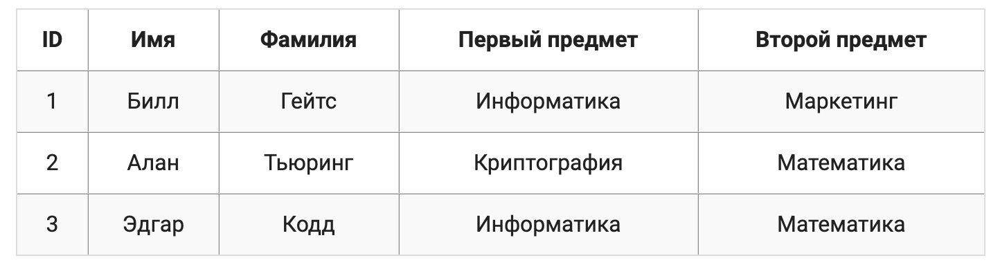
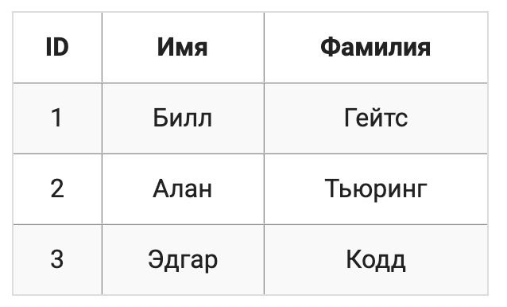
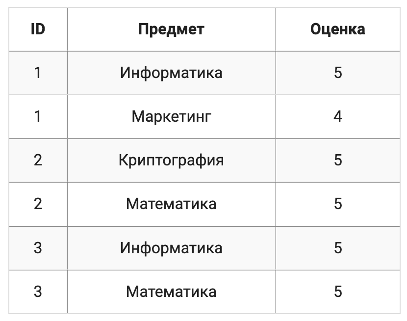
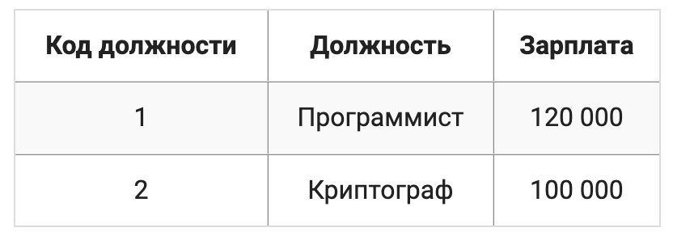

# 2.3 Нормальные формы

# Нормализация данных

Нормализация данных - это процесс организации в реляционных базах данных, который приводит данные к определенному стандарту в зависимости от степени нормальной формы, этот процесс делает базу данных более гибкой, устраняя избыточность данных и потенциальные ошибки.

Избыточность данных - это наличие повторяющейся или лишней информации в различных частях базы данных. Она приводит к непродуктивному расходу ресурсов хранилища и затрудняет обслуживание базы данных. В таблице ниже содержится избыточная инфомрация:

<kbd>

</kbd>

К примеру если название предмета **Информатика** изменить на **Компьютерные науки** , то его нужно изменить во всех записях о тех студентах которые изучают данный предмет. Потенциальная ошибка может заключаться в потере информации, к примеру если Эдгар решит больше не изучать математику, то придется удалить запись со сведениями о нем и тогда информация о данном предмете будет: полностью потеряна.

<kbd>

Ошибки, которые могут возникнуть при работе с ненормализованной базой данных, называются аномалиями. Выделяются три основных аномалии: аномалии вставки, удаления и модификации, которые возникают при соответствующих операциях 

</kbd>

# Нормальные формы

Существует несколько набор правил нормализации баз данных. Каждое такое правило называется **нормальной формой**. Если соблюдается первый набор правил - первая нормальная форма, то считается что база **приведена** к первой нормальной форме, если соблюдается первые три правила, считается что база приведена к **третьей** нормальной форме. 

<kbd>

Переход осуществляется последовательно, так например чтобы привести базу данных ко второй нормальной форме, обязательно необходимо привести ее сначала к первой нормальной форме.

</kbd>

Из основных нормальных форм, существует всего пять, это **первая**, **вторая**, **третья**, **четвертая**, **пятая**. Так же отдельно выделяются:

- шестая нормальная форма;
- нормальная форма Бойса-Кодда;
- доменно-ключевая нормальная форма;

База данных считается нормализованной если она приведена хотя бы к третьей нормальной форме. Нормализация до третьей нормальной формы является стандартной практикой так как устраняет достаточное количество аномалий. Ситуации при которых необходима нормализация до четвертой нормальной формы встречаются крайне редко.

**Все последующие нормальные формы относятся скорее к теоретическим, на практике трудно представить ситуации, при которых требуется нормализовать до них базу**

# Первая нормальная форма

Первая нормальная форма является начальным уровнем нормализацией данных и включает в себя следующие правила:

- в таблице не должно быть полей с одинаковым смыслом;
- в каждой ячейке таблицы должно находиться одиночное несоставное значение;
- таблица должна иметь первичный ключ(primary key);

Итак, стоит вспомнить из прошлой главы что поля, они же атрибуты это первая горизонталь данных а записи они же кортежи все последующие горизонтали.

Рассмотрим подробнее следующий пример:

<kbd>

</kbd>

Здесь мы можем видеть поле `Первый предмет` и `Второй предмет` что является нарушением первого правила **в таблице не должно быть полей с одинаковым смыслом**, в подобном примере сложно соблюдать согласованность данных так как у студентов в процессе обучения могут появлятся различные предметы и мы не можем до бесконечности писать первый, второй, третий и тд для этого придется целиком изменить структуру таблицы. 

Потенциальным решением может стать группировка похожих полей:

<kbd>

</kbd>

но данный пример противоречит второму правилу **в каждой ячейке таблицы должно находится одиночное несоставное значение** а здесь в последних ячейках несколько значений через запятую. Решением может стать дублирование записей, таким образом, чтобы каждое составное значение стало одиночным:

<kbd>

</kbd>

Теперь таблица находится в первой нормальной форме, она не имеет схожих по смыслу полей, в каждой ее ячейке находится одиночное значение, а первичным ключом в ней является сочетание полей `ID` и `Предмет`. Несмотря на все это, она подвержена аномалиям. В данную таблицу нельзя внести информацию о студенте, не указав хотя бы один изучаемый предмет, также невозможно удалить информацию об изучаемых студентом предметах, не удалив информацию о нем самом.

# Вторая нормальная форма

Вторая нормальная форма является логическим продолжением первой нормальной формы и содержит правила:

- таблица должна находиться в первой нормальной форме;
- каждое неключевое поле таблицы должно зависеть только от полного первичного ключа, то есть от всех его полей;

В примере рассмотрим предыдущую таблицу приведенную к первой нормальной форме, для большей наглядности добавим в нее еще одно поле:

<kbd>

</kbd>

Данная таблица не находится во второй нормальной форме так как нарушает правило **каждое неключевое поле таблицы должно зависеть только от полного первичного ключа, то есть от всех его полей**. В ней существует зависимость поля `Оценка` от полей `ID` и  `Предмет` (оценка зависит от студента и предмета), также зависимость полей `Имя` и `Фамилия` от поля `ID` (персональная информация студента зависит только от него самого). Таким образом, поля `Имя` и `Фамилия` зависят не от полного первичного ключа, а лишь от его части, так как первичным ключом является сочетание полей `ID` и `Предмет`, но при этом поле `Предмет` можно убрать без потери зависимости.

Чтобы приветси таблицу ко второй нормальной форме, необходимо разбить ее на несколько таблиц с учетом всех неполных зависимостей. В нашем случае неполную зависимость образуют поля `Имя` и `Фамилия`, поэтому их следует вынести в отедльную таблицу:

<kbd>

</kbd>

Исходная таблица примет следующий вид:

<kbd>

</kbd>

Теперь мы имеем две таблицы, каждая из которых находится во второй нормальной форме. После разбиения на две таблицы даныне студента и информация о его успеваемости стали независимыми. Это значит,что больше нет части аномалий, свойственных первой нормальной форме: вставка и удаление данных не затрагивают информацию, не связанную с ними напрямую.

<kbd>

Процесс разбиения таблицы на несколько таблиц называется декомпозицией

</kbd>

# Третья нормальная форма

Третья нормальная форма исправляет аномалии оставшиеся после приведения ко второй нормальной форме аномалии и имеет следующие правила:

- таблица должна находиться во второй нормальной форме;
- каждое неключевое поле таблицы должно зависеть только от первичного ключа и ни от какого другого неключевого поля;

Иными словами, третья нормальная форма говорит о том, что **неключевые поля** не должны вести себя как первичные ключи. Они не должны давать возможности получить данные из других полей, так как их задачей является лишь предоставление той информации, которая находится в них самих.

Рассмотрим таблицу, которая находится во второй нормальной форме:

<kbd>

</kbd>

Таблица содержит список сотрудников с указанием их должностей и размеров заработной платы. Первичным ключом в ней является поле `ID`. При этом известно, что размер заработной платы сотрудника полностью определяется занимаемой должностью. Здесь существует зависимость поля `Зарплата` от поля `Должность`, что является несоответствием второго требования **каждое неключевое поле таблицы должно зависеть только от первичного ключа и ни от какого другого неключевого поля**. Например если Алан решит стать программистом его зарплата останется на том же уровне и никаким образом ее нельзя будет: изменить. 

Таблица во второй нормальной форме приводится к третьей нормальной форме способом, похожим на то как таблица в первой нормальной форме приводится ко второй, путем декомпозиции с учетом всех неудовлетворяющих зависимостей. В нашем случае неудовлетворяющую зависимость образует поле `Зарплата`, поэтому его следует вынести в отдельную таблицу:

<kbd>

</kbd>

Исходная таблица примет следующий вид:

<kbd>

</kbd>

Теперь мы имеем две таблицы каждая из которых находится в третьей нормальной форме. Благодаря этому аномалия модификации не проявляется и любой сотрудник после изменения должности автоматически получит корректное изменение заработной платы.

Следует заметить, что в таблице с информацией о должностях каждой должности был присвоен уникальный код, который используется в таблице с работниками для указания занимаемой должности. Теперь если мы захотим переименовать должность **программист** в **разработчик**, это нужно будет: сделать единожды.

<kbd>

Приводить базу данных к третьей нормальной форме не всегда практичное решение, так как при данном изменении возрастает потребление ресурсов что приводит к снижению производительности.

</kbd>

#### Примечание 1. 

Нормализация предназначена для приведения структуры базы данных к виду, обеспечивающему минимальную логическую избыточность и не предназначен для уменьшения или увеличения производительности работы или же уменьшения или увеличения физического объема данных.

#### Примечание 2.

Если в таблице имеется только один потенциальный первичный ключ и он состоит из одного поля, то соответствие таблицы первой нормальной форме автоматически делает таблицу соответствующей второй нормальной форме

#### Примечание 3.

Cуществует также процесс **денормализации** данных. Денормализация заключается в намеренном приведении структуры базы данных в состояние, не соответствующее определенным нормальным формам и обычно используется для ускорения операций чтения из базы данных за счет добавления избыточных данных.

---