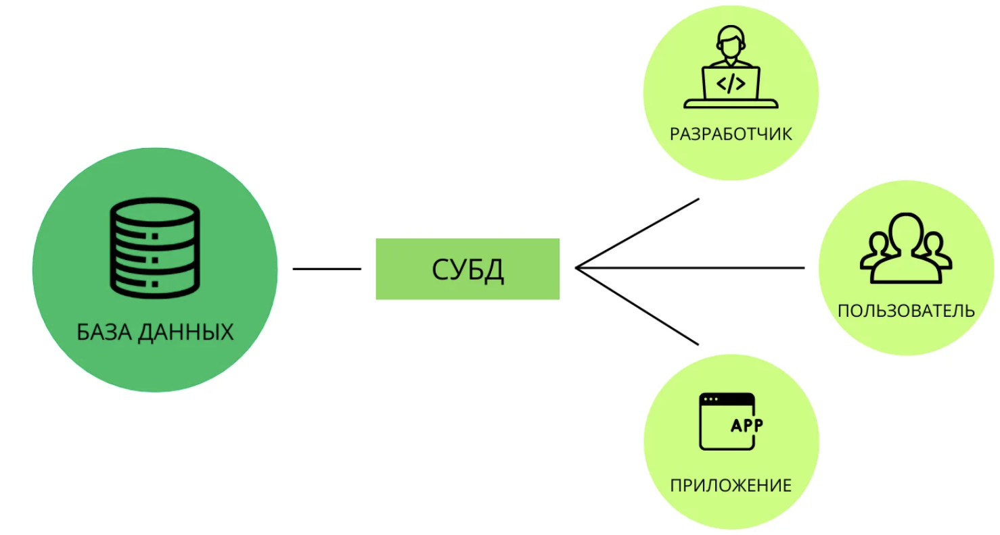

# 2.4 СУБД и язык SQL

# СУБД

**База данных** - организованная, структурированная коллекция данных. Не смотря на наличие структуры, база предоставляет всего лишь набор информации, хранящийся на физическом носителе. Сама по себе база данных не предполагает какого-либо инструментария для работы с ней, для этих целей была создана СУБД.

**СУБД(Система Управления Базами Данных)** - комплексное программное обеспечение которое служит интерфейсом между пользователями и базами данных, предоставляет возможность удобно взаимодействовать с базами данных и выполнять все необходимые действия.

<kbd>

</kbd>

Главное назначение СУБД - управлять базой данных. Помимо возможности извлекать, изменять, удалять и добавлять данные СУБД предоставляют возможности резервного копирование, восстановления данных после непредвиденных сбоев.

Также СУБД поддерживает многопользовательский режим работы, что обеспечивает согласованный доступ к базе данных множеству пользователей. СУБД предоставляют механизмы для защиты данных включая аутентификацию, авторизацию и шифрование.

Для работы с СУБД используются определенные языки программирования. Разработчик следуя синтаксису пишет программный код и выполняет все необходимые операции с базой данных, такие как добавление в таблицу базы данных новой записи или извлечение записи из таблицы с дополнительной фильтрацией и сортировкой. Каждое подобное обращение к базе данных называется **запросом**

<kbd>

</kbd>

Взаимодействия конечного пользователя с базой данных также происходит при помощи запросов. Например когда пользователь читает описание товара в интернет магазине, сайт составляет запрос к базе данных и отправляет его СУБД. Она обрабатывает его и предоставляет необходимую информацию.

<kbd>
<div style="display:flex; align-items:center;">

<p>
Языки программирования, используемые СУБД для работами с базами данных, называются языками запросов
</p>
</div>
</kbd>

# Типы СУБД

Сегодня существует много типов СУБД, но обычно их классифицируют по расположению базы данных, способу обработки данных, выбранной модели хранения и используемому языку запросов.

# Расположение базы данных

В зависимости от расположения СУБД их разделяют на **локальные** и **распределенные** , локальные позволяют хранить данные только в одном месте, распределенные в свою очередь предполагают согласованное хранение данных на нескольких узлах, которые физически могут находиться в разных местах.

Многие современные СУБД поддерживают оба типа.

# Хранение и обработка данных

По способу хранения и обработки данных СУБД делятся на **клиент-серверные**, **файл-серверные** и **встраиваемые**. Клиент-серверные предполагают что СУБД и база данных размещены на одном узле, к которому обращаются с запросом разные пользователи.

Файл-серверный тип предполагает хранение базы данных на одном **файл-сервере** , а СУБД на каждом устройстве, с которого отправляются запросы к базе данных. Чтобы пользователь мог обращаться и взаимодейтсвовать с данными у него должна быть установлена СУБД.

Встраиваемые предназначены для полной интеграции в приложения. Использование, хранение и управление данными как правило осуществляется только внутри этих приложений.

# Структура и организация данных

СУБД классифицируется по используемым моделям баз данных, будь то иерархическая или сетевая они также и будут называться, иерархическая СУБД, сетевая СУБД, реляционная.

# Используемый язык запросов

Чаще всего СУБД делятся на два типа в зависимости от языка программирования которые они используют это **SQL-ориентированные** и **noSQL-ориентированные** . SQL-ориентированные СУБД для управления данными используют язык под названием SQL, noSQL-ориентированные СУБД используют языки отличные от SQL.

SQL является стандартным языком для всех реляционных СУБД, поэтому разделяя СУБД по этому разделяя СУБД по используемому языку мы разделяем их на реляционные и не реляционные.

<kbd>
<div style="display:flex; align-items:center;">

<p>
noSQL-ориентированные СУБД чаще всего используются там, где нужно работать с данными имеющими сложную структуру.
</p>
</div>
</kbd>

# Язык SQL

Реляционные СУБД - одни из самых распространненых систем. Как уже было сказано ранее, для управления данными они используют язык **SQL(Structured Query Language)** , который был специально разработан для работы с базами данных, принадлежащих реляционной модели.

SQL является слабоструктурированным языком, особенно по сравнению с высокоструктурированными языкми как Python или Java. SQL - запросы напоминают обычные предложения английского языка содержащие слова-пустышки, не влияющие на функциональность часть запроса, но облегчающих чтение.

Например, SQL - запрос, направленный на извлечение информации из базы данных может выглядеть следующим образом:

```
SELECT title
FROM Movies
WHERE rating BETWEEN 7 AND 9
```

SQL является декларативным языком, с помощью SQL программист описывает только то, какие данные нужно извлечь или модифицировать. Каким образом это сделать, решает СУБД при обработке SQL - запроса. Чем сложнее сконструирован запрос, тем больше он допускает вариантов написания, различных по скорости выполнения, но одинаковых по итоговому набору данных. 

<kbd>
<div style="display:flex; align-items:center;">

<p>
SQL - это способ формулировки запросов к базе данных, а СУБД обеспечивает выполнение этих запросов и управление физическими данными в базе. 
</p>
</div>
</kbd>

# Группы операторов SQL

Язык SQL представляет собой набор операторов, которые делятся на определенные группы и у каждой группы свое назначение, в сокращенном виде эти групы называются **DDL**, **DML**, **DCL**, **DQL**, **TCL**: 

<kbd>
<div style="display:flex; align-items:center;">

<p>
Группы операторов SQL иногда называют подмножествами SQL 
</p>
</div>
</kbd>

# DDL

**Data Definition Language(DDL)** - это группа операторов определения данных. С помощью операторов входящих в эту группу, мы определяем структуру базы данных и работаем с объектами этой базы, то есть создаем, изменяем и удаляем их.

В эту группу входят следующие операторы:

- `CREATE` - используется для создания объектов базы данных
- `ALTER` - используется для изменения объектов базы данных
- `DROP` - используется для удаления объектов базы данных

# DML

**Data Manipulation Language(DML)** - это группа для манипуляции с данными. С помощью этих операторов мы можем добавлять, изменять, удалять и выгружать данные из базы, манипулировать ими.

В эту группу входят самые распространенные операторы языка SQL:

- `INSERT` - добавляет новые данные
- `UPDATE` - изменяе существующие данные
- `DELETE` - удаляет данные

<kbd>
<div style="display:flex; align-items:center;">

<p>
Чаще всего программистам приходится работать именно с группой DML
</p>
</div>
</kbd>

# DCL

**Data Control Language(DCL)** - группа операторов определения доступов к данным. Операторы управления разрешениями. С их помощью мы можем разрешать и запрещать выполнение определенных операций над объектами базы данных.

Сюда входят:

- `GRANT` - предоставляет пользователю или группе пользователей разрешения на определенные операции с объектом
- `REVOKE` - отзывает выданные разрешения
- `DENY` - задает запрет, имеющий приоритет над разрешением.
  
# DQL

**Data Query Language(DQL)** - группа операторов для выполнения запросов по извлечению данных из таблиц, состоит из единственного оператора:

- `SELECT` - осуществляет выборку данных

# TCL

**Transaction Control Language(TCL)** - группа операторов для управления транзакциями. Транзакция это команда или блок команд, которые выполняются как единое целое. Если транзакция выполнена успешно, все модификаци данных, сделанные в течении транзакции, принимаются и становятся постоянной частью базы данных. Если в результате выполнения транзакции происходит ошибка, все выполненные модификации будут отменены.

Група операторов TCL предназначена для реализации и управления транзакциями. Сюда можно отнести:

- `BEGIN TRANSACTION` - служит для определения начала транзакции
- `COMMIT TRANSACTION` - применяет транзакцию 
- `ROLLBACK TRANSACTION` - откатывает изменения, сделанные в контексте текущей транзакции
- `SAVE TRANSACTION` - устанавливает промежуточную точку сохранения внутри транзакции

---