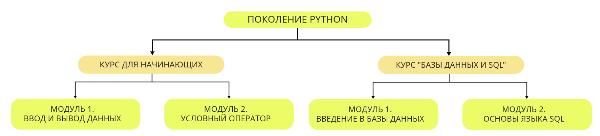
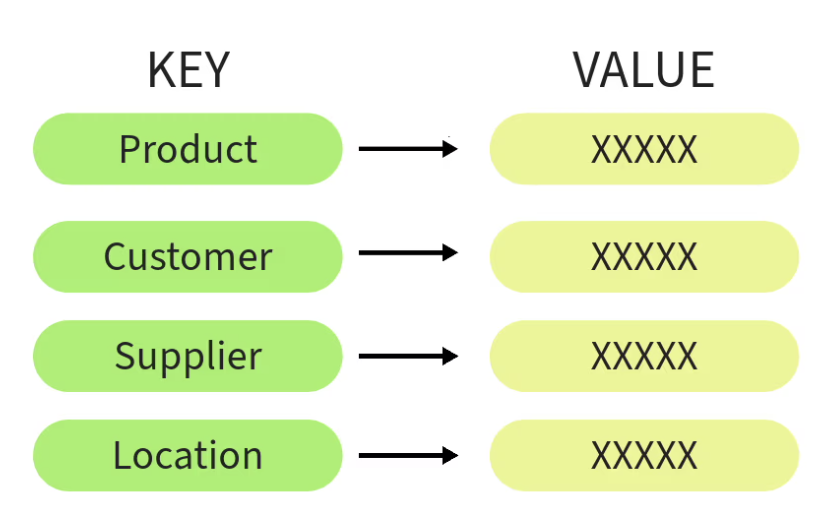
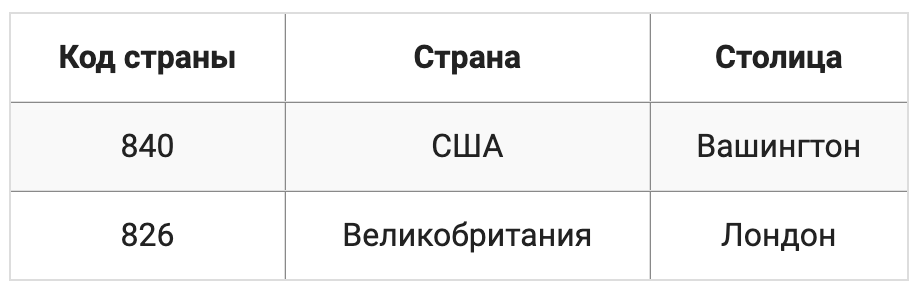

# 2.1 Базы данных

# Развитие баз данных

---

В начале развития баз данных информация хранилась в простом формате называемым **плоские файлы**.
Это обыкновенные текстовые файлы, информация в которых хранится в виде записей без организации или структуры.
Плоские файлы просты в использовании, но не предоставляют механизмов для связи или структурирования данных что затрудняет эффективный доступ к информации.

<kbd>
<div style="display:flex; align-items:center;">

<p>
Плоские файлы используются повсеместно до сих пор для хранения различной информации.
Примером могут служить файлы формата CSV
</p>
</div>
</kbd>

---

# Иерхархическая модель

В 1960-х годах была разработана иерархическая модель баз данных, представляет собой древовидную иерархическую структуру и используется для организации данных с иерархической структурой. В ней данные организованы в виде древовидной структуры, где каждая запись имеет родительскую запись, кроме верхнего уровня как показано на схеме. Это позволяет организовывать данные с иерархическими связями, но требует заранее определенной структуры данных.

<kbd>

</kbd>

Для того чтобы легче запомнить, постараюсь привести пример организации данных использующих иерархические связи. 
Итак у нас есть самый многочисленный отряд млекопитающих **грызуны**, все они принадлежат к одному отряду, имеют общий сегмент, но видов очень много:

```
Грызуны:
├── Мыши
│   ├── Мышиные семейства
│   │   ├── Обыкновенная мышь
│   │   └── Полярная мышь
├── Крысы
│   ├── Крысиные семейства
│   │   ├── Крыса-белка
│   │   ├── Лабораторная крыса
│   │   └── Домовая крыса
├── Белки
│   ├── Беличьи семейства
│   │   ├── Евразийская белка
│   │   ├── Американская белка
│   │   └── Японская белка
├── Бурундуки
│   ├── Бурундучьи семейства
│   │   ├── Североамериканский бурундук
│   │   ├── Евразийский бурундук
│   │   └── Краснобрюхий бурундук
├── Хомяки
    ├── Хомячьи семейства
        ├── Ондатра
        ├── Хомячок Роборовского
        └── Золотистый хомяк
```

<kbd>
<div style="display:flex; align-items:center;">

<p>
Иерархическая модель появилась впервые в результате обобщения структур данных языка COBOL
</p>
</div>
</kbd>

Главным недостатком иерархической модели является ее неуниверсальность, в реальном мире не все данные могут быть представленны в виде древовидной структуры с одним корневым сегментом. 
Иерархическая модель применима когда между объектами существуют реальные иерархические связи.

<kbd>
<div style="display:flex; align-items:center;">

<p>
Данные в иерархической структуре неравноправны - одни жестко подчинены другим
</p>
</div>
</kbd>

--- 

# Сетевая модель

Сетевая модель была разработана в 1960-1970х годах и представляет с собой расширение иерархической модели. В этой модели данные представляются в виде сети, где каждая запись может быть связана с несколькими другими записями как показано на схеме:

<kbd>

</kbd>

<kbd>
<div style="display:flex; align-items:center;">

<p>
Связи между записями могут быть произвольными, и эти связи явно присутствуют и хранятся в базе данных
</p>
</div>
</kbd>

---

# Реляционная модель

Реляционная модель стала широко применятся в 1970-х годах и является стандартом для многих СУБД и по сей день. Она была разработана для управления структурированными данными с использованием табличной модели.

Реляционные базы данных организованы в виде набора связанных таблиц. Каждый столбец имеет имя и определенный тип(текст, число, дата). Каждая строка таблицы представляет собой набор связанных значений, относящихся к одной сущности. Помимо этого каждая строка помечается уникальным идентификатором, а строки из нескольких таблиц могут быть связаны между собой с помощью этих идентификаторов.

<kbd>

</kbd>

Гибкость реляционных баз данных заключается в том что таблицы хранящие данные в значительной степени независимы друг от друга. Существует возможность добавлять данные в таблицу, удалять их из нее, вносить изменения при этом не затрагивая данные в других таблицах

---

# Модель ключ-значение

В начале 2000-х годов была представлена модель работающая по принципу **ключ-значение** или другими словами **хэш-таблица** каждому значению сопоставляется уникальный ключ, по которому с этим значением можно взаимодействовать.


<kbd>

</kbd>

Базы данных основанных на принципах ключ-значение обеспечивают быстрый доступ к данным и простую структуру хранения. Эта модель используется чаще всего где основной упор делается на производительность и масштабируемость, она плохо сопоставима сложной обработкой или анализом данных, но годится для приложений где важен быстрый доступ к информации. Чаще всего применяется для кэширования данных

---

# Документная модель

Документоориентированная модель появилась так же как и модель ключ-значение в 2000-х году, как ответ на требования областей веб-разработки и соцсетей, которым необходима высокая масштабируемость и гибкость при работе с неструктурированными данными. Основная идея модели заключается в хранении данных в виде документов, которые обычно представлены в формате `JSON` или  `XML` 

<kbd>

</kbd>

Каждый документ представляет собой самодостаточную единицу данных, содержащий полную информацию о своей сущности.

<kbd>

</kbd>

Организационная структура документоориентированных баз основывается на коллекциях или контейнерах, в которых хранятся документы. Коллекции могут содержать произвольное количество документов, и каждый документ может быть проиндексирован или иметь уникальный идентификатор для быстрого доступа к нему.

---

# 2.2 Реляционные базы данных

Среди всех существующих моделей баз данных, на данный момент доминирующей является реляционная модель, предложенная Эдгаром Коддом (специалистом в области математики и информатики) в 1970-м году

<kbd>
<div style="display:flex; align-items:center;">

<p>
Эдгар Кодд за свой вклад в развитие баз данных был удостоен большим количеством наград, включая премию Тьюринга которую он получил в 1981 году
</p>
</div>
</kbd>

Реляционная модель представляет собой совокупность данных, состоящих из набора таблиц. В теории множеств которая легла в основу проектирования реляционной модели есть термин который соответствует таблице - отношения(relations) а таблица является его физическим представлением. Именно по этому модель получила свое название - реляционная.

Любая таблица в реляционной базе данных состоит из строк называемых **записями** и столбцов которые называют **полями**. На пересечении строк и столбцов находятся конкретные значения. Запись представляет собой набор значений, содержащих информацию о конкретной сущности, полем же является отдельная характеристика сущности.

Например, в таблице ниже содержатся 3 записи, 4 поля и 12 значений:

<kbd>

</kbd>

Таблица в реляционной базе данных обладает рядом необычных свойств, которые отличают ее от обычных таблиц. Каждое поле всегда имеет уникальное имя и тип данных, хранимых в этом поле. Если поле используется для хранения имени то его тип будет строковым, если для возраста - числовым. Никакая другая таблица в реляционной базе данных не может носить то же имя что и другая.

# Первичный ключ

Поле (или несколько полей), значения которого однозначно определяют записи таблицы, называется **первичным ключом** (primary key).
То есть первичный ключ - это такое поле, значение которого в таблице не повторяются. Так, в таблице представленной выше поле `ID` выступает первичным ключом, предоставляющее уникальный идентфикатор определенного человека. Первичным ключом могли быть поля `Имя` и `Фамилия`, однако у людей могут быть одинаковые имена и фамилии, поэтому для однозначности в таблицу было включено поле `ID`

<kbd>
<div style="display:flex; align-items:center;">

<p>
Первичный ключ, состоящий из одного поля называют простым. В случае если первичный ключ включает несколько полей его называют составным
</p>
</div>
</kbd>

# Внешний ключ

Таблица может содержать информацию, используемую для связи с другой таблицей. Осуществляется такая навигация с помощью **внешних ключей** (foreign key). Для понимания того как работают внешние ключи рассмотрим таблицу:

<kbd>

</kbd>

Первичным ключом здесь является поле **Код страны** 

Расширим также таблицу, предложенную вначале урока - добавим в нее поле с кодом страны рождения, в качестве значений этого поля  воспользуемся значениями первичного ключа таблицы с данными о странах:

<kbd>

</kbd>

Во второй таблице поле `Код страны рождения` представляет собой внешний ключ. То есть внешний ключ это поле в одной таблице, которые связывается с первичным ключом другой таблицы. Он задает связь между таблицами, позволяя ссылаться на данные в одной таблице из другой таблицы. Внешний ключ также как и первичный может включать в себя несколько полей.

<kbd>
<div style="display:flex; align-items:center;">

<p>
Таблица которая ссылается на данные из другой таблицы называется дочерней, таблица на данные которой ссылается другая таблица называется родительской.
</p>
</div>
</kbd>

На первый взгляд может быть не понятно как использовать полученные таблицы для поиска информации: например, столица страны, в которой родился Эдгар Кодд. Для этого необходимо сначала найти запись с данными Эдгара и узнать код страны его рождения. Затем, используя полученный код, мы найдем запись с данными о стране во второй таблице и получим искому столицу. 

Таким образом благодаря первичным и внешним ключам устанавливаются связи между таблицами. Группа связанных таблиц называется схемой данных. Чаще всего она изображается в виде таблиц, соединенных линиями или стрелками, которые и показывают имеющиеся между таблицами связи. Для рассмотренных выше таблиц схема будет иметь следующий вид:

<kbd>

</kbd>

В схеме каждая таблица не представлена вместе со всем содержимым: в ней указаны лишь ее имя и соответствующий набор полей.

#### Примечание 1. 

Первичные ключи не являются обязательными, но большинство разработчиков баз данных создают их для каждой таблицы, чтобы в будущем иметь возможность выполнять любые манипуляцие с данными.

#### Примечание 2.

Для реляционной модели имеется развитый математический аппарата - реляционная алгебра. В ней определяются различные операции над таблицами: например объединение или декартово произведение. В реляционной алгебре поле называется **атрибутом**, а запись - **кортежем**. Также для каждого поля определяется множество всех возможных значений, называемое **доменом**

# 2.3 Нормальные формы

# Нормализация данных

Нормализация данных - это процесс организации в реляционных базах данных, который приводит данные к определенному стандарту в зависимости от степени нормальной формы, этот процесс делает базу данных более гибкой, устраняя избыточность данных и потенциальные ошибки.

Избыточность данных - это наличие повторяющейся или лишней информации в различных частях базы данных. Она приводит к непродуктивному расходу ресурсов хранилища и затрудняет обслуживание базы данных. В таблице ниже содержится избыточная инфомрация:

<kbd>

</kbd>

К примеру если название предмета **Информатика** изменить на **Компьютерные науки** , то его нужно изменить во всех записях о тех студентах которые изучают данный предмет. Потенциальная ошибка может заключаться в потере информации, к примеру если Эдгар решит больше не изучать математику, то придется удалить запись со сведениями о нем и тогда информация о данном предмете будет полностью потеряна.

<kbd>
<div style="display:flex; align-items:center;">

<p>
Ошибки, которые могут возникнуть при работе с ненормализованной базой данных, называются аномалиями. Выделяются три основных аномалии: аномалии вставки, удаления и модификации, которые возникают при соответствующих операциях 
</p>
</div>
</kbd>

# Нормальные формы

Существует несколько набор правил нормализации баз данных. Каждое такое правило называется **нормальной формой**. Если соблюдается первый набор правил - первая нормальная форма, то считается что база **приведена** к первой нормальной форме, если соблюдается первые три правила, считается что база приведена к **третьей** нормальной форме. 

<kbd>
<div style="display:flex; align-items:center;">

<p>
Переход осуществляется последовательно, так например чтобы привести базу данных ко второй нормальной форме, обязательно необходимо привести ее сначала к первой нормальной форме.
</p>
</div>
</kbd>

Из основных нормальных форм, существует всего пять, это **первая**, **вторая**, **третья**, **четвертая**, **пятая**. Так же отдельно выделяются:

- шестая нормальная форма;
- нормальная форма Бойса-Кодда;
- доменно-ключевая нормальная форма;

База данных считается нормализованной если она приведена хотя бы к третьей нормальной форме. Нормализация до третьей нормальной формы является стандартной практикой так как устраняет достаточное количество аномалий. Ситуации при которых необходима нормализация до четвертой нормальной формы встречаются крайне редко.

**Все последующие нормальные формы относятся скорее к теоретическим, на практике трудно представить ситуации, при которых требуется нормализовать до них базу**

# Первая нормальная форма

Первая нормальная форма является начальным уровнем нормализацией данных и включает в себя следующие правила:

- в таблице не должно быть полей с одинаковым смыслом;
- в каждой ячейке таблицы должно находиться одиночное несоставное значение;
- таблица должна иметь первичный ключ(primary key);

Итак, стоит вспомнить из прошлой главы что поля, они же атрибуты это первая горизонталь данных а записи они же кортежи все последующие горизонтали.

Рассмотрим подробнее следующий пример:

<kbd>

</kbd>

Здесь мы можем видеть поле `Первый предмет` и `Второй предмет` что является нарушением первого правила **в таблице не должно быть полей с одинаковым смыслом**, в подобном примере сложно соблюдать согласованность данных так как у студентов в процессе обучения могут появлятся различные предметы и мы не можем до бесконечности писать первый, второй, третий и тд для этого придется целиком изменить структуру таблицы. 

Потенциальным решением может стать группировка похожих полей:

<kbd>

</kbd>

но данный пример противоречит второму правилу **в каждой ячейке таблицы должно находится одиночное несоставное значение** а здесь в последних ячейках несколько значений через запятую. Решением может стать дублирование записей, таким образом, чтобы каждое составное значение стало одиночным:

<kbd>

</kbd>

Теперь таблица находится в первой нормальной форме, она не имеет схожих по смыслу полей, в каждой ее ячейке находится одиночное значение, а первичным ключом в ней является сочетание полей `ID` и `Предмет`. Несмотря на все это, она подвержена аномалиям. В данную таблицу нельзя внести информацию о студенте, не указав хотя бы один изучаемый предмет, также невозможно удалить информацию об изучаемых студентом предметах, не удалив информацию о нем самом.

# Вторая нормальная форма

Вторая нормальная форма является логическим продолжением первой нормальной формы и содержит правила:

- таблица должна находиться в первой нормальной форме;
- каждое неключевое поле таблицы должно зависеть только от полного первичного ключа, то есть от всех его полей;

В примере рассмотрим предыдущую таблицу приведенную к первой нормальной форме, для большей наглядности добавим в нее еще одно поле:

<kbd>

</kbd>

Данная таблица не находится во второй нормальной форме так как нарушает правило **каждое неключевое поле таблицы должно зависеть только от полного первичного ключа, то есть от всех его полей**. В ней существует зависимость поля `Оценка` от полей `ID` и  `Предмет` (оценка зависит от студента и предмета), также зависимость полей `Имя` и `Фамилия` от поля `ID` (персональная информация студента зависит только от него самого). Таким образом, поля `Имя` и `Фамилия` зависят не от полного первичного ключа, а лишь от его части, так как первичным ключом является сочетание полей `ID` и `Предмет`, но при этом поле `Предмет` можно убрать без потери зависимости.

Чтобы приветси таблицу ко второй нормальной форме, необходимо разбить ее на несколько таблиц с учетом всех неполных зависимостей. В нашем случае неполную зависимость образуют поля `Имя` и `Фамилия`, поэтому их следует вынести в отедльную таблицу:

<kbd>

</kbd>

Исходная таблица примет следующий вид:

<kbd>

</kbd>

Теперь мы имеем две таблицы, каждая из которых находится во второй нормальной форме. После разбиения на две таблицы даныне студента и информация о его успеваемости стали независимыми. Это значит,что больше нет части аномалий, свойственных первой нормальной форме: вставка и удаление данных не затрагивают информацию, не связанную с ними напрямую.

<kbd>
<div style="display:flex; align-items:center;">

<p>
Процесс разбиения таблицы на несколько таблиц называется декомпозицией
</p>
</div>
</kbd>

# Третья нормальная форма

Третья нормальная форма исправляет аномалии оставшиеся после приведения ко второй нормальной форме аномалии и имеет следующие правила:

- таблица должна находиться во второй нормальной форме;
- каждое неключевое поле таблицы должно зависеть только от первичного ключа и ни от какого другого неключевого поля;

Иными словами, третья нормальная форма говорит о том, что **неключевые поля** не должны вести себя как первичные ключи. Они не должны давать возможности получить данные из других полей, так как их задачей является лишь предоставление той информации, которая находится в них самих.

Рассмотрим таблицу, которая находится во второй нормальной форме:

<kbd>

</kbd>

Таблица содержит список сотрудников с указанием их должностей и размеров заработной платы. Первичным ключом в ней является поле `ID`. При этом известно, что размер заработной платы сотрудника полностью определяется занимаемой должностью. Здесь существует зависимость поля `Зарплата` от поля `Должность`, что является несоответствием второго требования **каждое неключевое поле таблицы должно зависеть только от первичного ключа и ни от какого другого неключевого поля**. Например если Алан решит стать программистом его зарплата останется на том же уровне и никаким образом ее нельзя будет изменить. 

Таблица во второй нормальной форме приводится к третьей нормальной форме способом, похожим на то как таблица в первой нормальной форме приводится ко второй, путем декомпозиции с учетом всех неудовлетворяющих зависимостей. В нашем случае неудовлетворяющую зависимость образует поле `Зарплата`, поэтому его следует вынести в отдельную таблицу:

<kbd>

</kbd>

Исходная таблица примет следующий вид:

<kbd>

</kbd>

Теперь мы имеем две таблицы каждая из которых находится в третьей нормальной форме. Благодаря этому аномалия модификации не проявляется и любой сотрудник после изменения должности автоматически получит корректное изменение заработной платы.

Следует заметить, что в таблице с информацией о должностях каждой должности был присвоен уникальный код, который используется в таблице с работниками для указания занимаемой должности. Теперь если мы захотим переименовать должность **программист** в **разработчик**, это нужно будет сделать единожды.

<kbd>
<div style="display:flex; align-items:center;">

<p>
Приводить базу данных к третьей нормальной форме не всегда практичное решение, так как при данном изменении возрастает потребление ресурсов что приводит к снижению производительности.
</p>
</div>
</kbd>

#### Примечание 1. 

Нормализация предназначена для приведения структуры базы данных к виду, обеспечивающему минимальную логическую избыточность и не предназначен для уменьшения или увеличения производительности работы или же уменьшения или увеличения физического объема данных.

#### Примечание 2.

Если в таблице имеется только один потенциальный первичный ключ и он состоит из одного поля, то соответствие таблицы первой нормальной форме автоматически делает таблицу соответствующей второй нормальной форме

#### Примечание 3.

Cуществует также процесс **денормализации** данных. Денормализация заключается в намеренном приведении структуры базы данных в состояние, не соответствующее определенным нормальным формам и обычно используется для ускорения операций чтения из базы данных за счет добавления избыточных данных.

